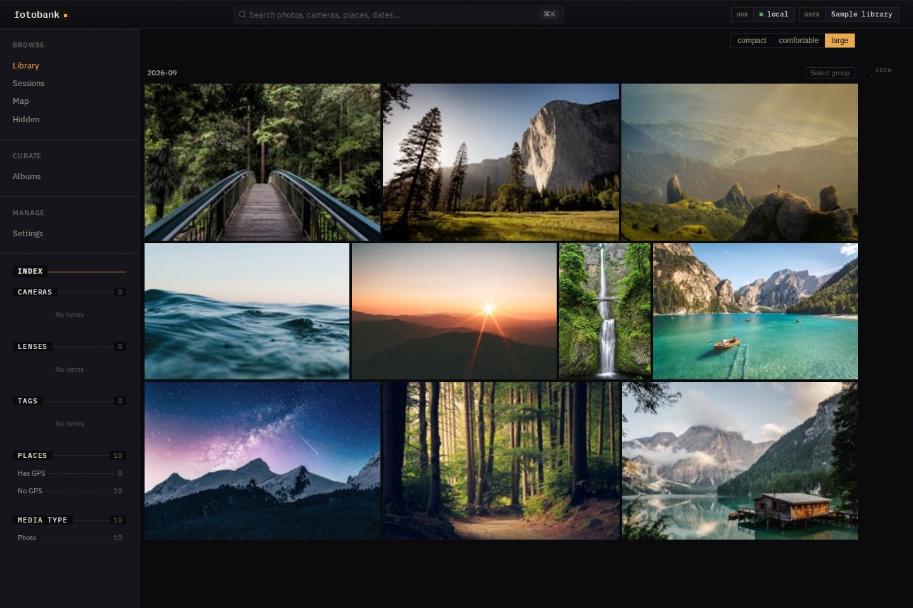

# Fotobank

Fotobank is a photo system of record for you and your agents, built on
[Docbank](https://github.com/kenn-io/docbank).

Your photos are among the most important things you own. They hold family
history, creative work, and moments you cannot recreate. Fotobank exists to
keep that record under your control—and make it useful as your collection,
tools, and ways of working change.

It combines a versioned archive with a photo catalog, a web app, and commands
for your own tools and agents. Browse and search photos, keep related files
together, organize albums, and work with selected files in an editor.

Fotobank is pre-alpha software, with no stability guarantees. Expect bugs and
changing interfaces and schemas. Keep independent copies of irreplaceable
photos. Start with copies of a small collection and test recovery separately.

[Try Fotobank](docs/guides/setup.md) · [How it works](website/guide.md) ·
[Commands for agents](docs/guides/automation.md)



The running app with a sample library. Sample photos from
[Unsplash](https://unsplash.com); [image credits](docs/publishing.md#sample-library-screenshot).

## Why another photo application?

Fotobank is not an attempt to match [Immich](https://github.com/immich-app/immich)
feature for feature. It starts with a particular question: what should hold
your photographic record when both people and agents work with it?

A photograph is often more than one file. There may be a camera RAW, a JPEG,
an XMP sidecar, and several edits. An album records a choice you made. A caption
may be your own description or a model's interpretation. A search index is
useful, but it is not the photograph.

Those distinctions shape Fotobank:

- Exact files and their versions belong in durable storage, independent of
  the editor, model, or interface using them.
- Related files, albums, privacy, and sharing belong in a photo catalog,
  rather than being repeatedly guessed from directory names.
- External tools need ordinary working files. Their edits should return as
  explicit new versions, not silently replace the archive.
- Agents need documented operations and inspectable results, not permission
  to rearrange storage internals.
- Generated descriptions, previews, and indexes should help you use the
  record—not define what survives when a tool or provider changes.

The web app matters. So do editing workflows, automation, and recovery. They
are different ways of working with the same photo record.

## Part of a personal OS for the agentic era

A personal OS brings the important parts of your life into systems you
control, with interfaces that let your chosen tools and agents work together.

Docbank provides a system of record for documents and files. Fotobank builds
the photographic part of that world: the meaning of related files, the
collections you curate, what stays private, and what you choose to share.

[msgvault](https://msgvault.io) ([source](https://github.com/kenn-io/msgvault))
is a sibling personal OS project. Together, these projects build toward systems
you control, with useful interfaces for both people and their agents.

The goal is to support work such as finding photographs by what they show,
proposing tags and descriptions, preparing an album for review, or handing
selected files to an editing tool. These are directions for agent workflows,
not claims that Fotobank already has an autonomous assistant.

The web app and CLI use the daemon's HTTP API. See the
[automation guide](docs/guides/automation.md) for command behavior and limits.
MCP integration remains a goal. Agents do not own a separate catalog.

## Docbank stores the record. Fotobank understands the photo library.

Fotobank embeds Docbank as a Go library; it does not require a second daemon.
Docbank holds exact content, immutable versions, and the storage machinery
behind them. It already supplies source metadata and canonical image previews
that Fotobank uses for photo details and thumbnails.

Fotobank owns photographs and their file relationships, albums, privacy,
sharing, browsing, and writable checkouts. Each cataloged file points to an
exact Docbank version. Complete recovery archives capture both the catalog and
Docbank content: your album choices and file relationships cannot be recovered
from the original bytes alone.

## What you can do today

- Import photos, videos, RAW files, and sidecars without modifying the source.
  Keep related files together and detect duplicate content in your library.
- Browse the library, inspect photo details, organize albums, and manage
  privacy and sharing. The in-app sharing controls are optional; the CLI and API
  remain available.
- Create partial, writable checkouts for editors and shell tools. Inspect
  changes and explicitly commit settled edits as new versions, with conflicts
  reported when the stored base has changed.
- Search photo metadata without AI, from the web app or CLI. Configure
  providers to try optional tagging, captioning, and embedding-based search.
  Generated results record the model and input that produced them.
- Download verified originals and attachments through the CLI for scripts and
  agents, without direct access to the archive's internal files.
- Create complete recovery archives, schedule backups with retention, and
  verify a restore into separate storage.

These are development capabilities, not a promise of a finished consumer
product. Start with the [workflow guide](website/guide.md),
[operating documentation](docs/index.md), and
[current architecture](docs/architecture/README.md).

## Optional AI and future work

AI is disabled by default. Enabling it requires configuring providers and
acknowledging processing of hidden media. Hidden-media controls govern access
through the application; they do not encrypt files. Read the
[AI privacy rules](docs/architecture/search-and-ai.md#failure-and-privacy-rules)
before enabling processing.

Tagging, captioning, image embeddings, and search currently run in Fotobank.
Embeddings are numeric descriptions used to compare images and search text.
The goal is to move reusable AI processing into Docbank so applications can
share it. Broader enrichment and agent workflows remain aspirations.

## Get started

The [setup guide](docs/guides/setup.md) covers building the current source,
configuring storage, starting the daemon, and importing a small collection.
You can try it with local folders under your own OS account; a NAS and separate
user registration are not required.
The setup is developer-oriented; it is not a stable release or a managed service.

After setup, use the same configuration and OS account for the web app and CLI:

```sh
fotobank daemon start                 # prints the web UI URL
fotobank import /path/to/sample-photos
fotobank media list --limit 5 --json
fotobank media search "sunset" --json
```

Metadata search works without AI. The [automation guide](docs/guides/automation.md)
explains filters, pagination, structured results, and command limits.
[Checkouts](docs/guides/checkouts.md) provide working files for editors.
[Back up and restore](docs/guides/backup.md) explains how to capture the catalog
and content together and test recovery into separate storage.

## Development

Useful targets:

```sh
make test             # Go test suite with sqlite_fts5 tag
make test-short       # Short Go tests
make frontend-check   # Svelte typecheck and frontend unit tests
make test-e2e         # Playwright e2e suite
make lint             # golangci-lint plus local testify helper check
make api-generate     # regenerate OpenAPI and TypeScript schema
```

## License

Copyright 2026 Kenn Software LLC. Licensed under the Apache License 2.0. See
[LICENSE](LICENSE) and [NOTICE](NOTICE).
