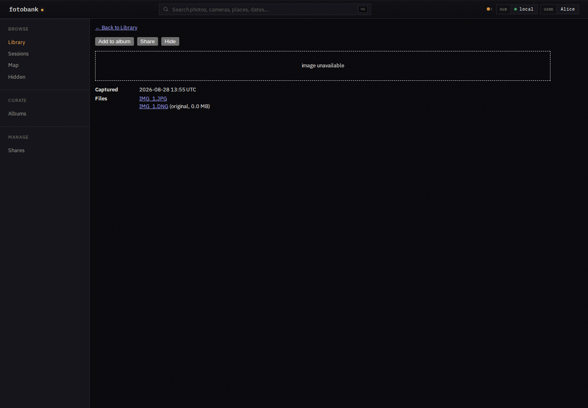
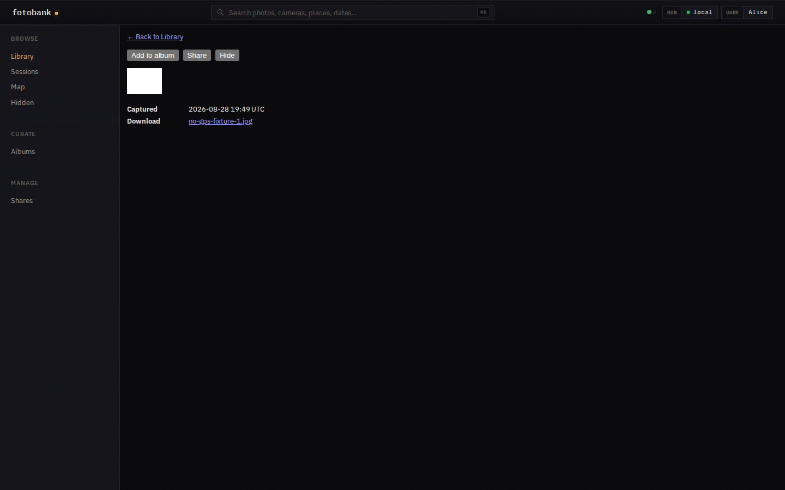
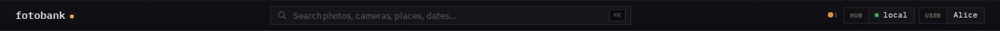
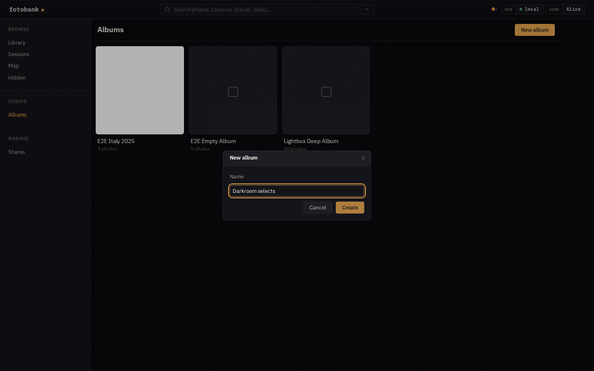
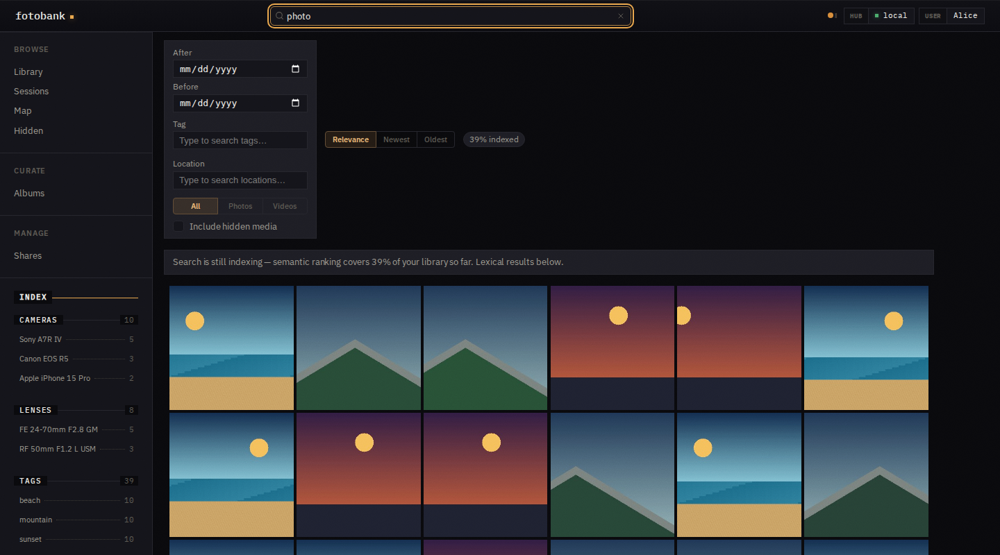

# Frontend

## Build and embedding

`frontend/` is a Svelte and TypeScript single-page application built with Bun.
The production build is copied into `internal/web/dist` and embedded in the Go
binary. `internal/web` serves the application shell for non-API paths so client
routes work after a direct browser refresh.

`make build` builds the frontend before compiling Go. A direct `go build` uses
whatever assets are already present in `internal/web/dist` and is therefore not
the normal full-product build.

## API contract

The frontend calls `/api/v1`. Huma generates `openapi.json` through the same
JSON operation definitions used by the server, including search, AI, and
facets. The generator supplies no runtime services and does not open storage
or contact providers. Handlers check service availability when called.

`make api-generate` updates the OpenAPI file and generated TypeScript schema.
JSON API changes must regenerate both before commit. The live server exposes
the schema at `/api/openapi.json` and interactive documentation at `/api/docs`.

Full-size media and thumbnail endpoints are raw byte routes because they need
range requests, streaming, cache validators, and content headers. JSON routes
remain in the generated contract.

## Routes and state

`frontend/src/App.svelte` owns top-level routing and session feature flags.
Route components cover the library, media detail, map, albums, hidden library,
shares, search, sessions, and user/admin AI settings.

The browser treats server data as authoritative. Local state holds view
preferences, paging cursors, lightbox position, and short-lived optimistic UI
only. Server-sent events invalidate affected views; reconnect or missed events
fall back to ordinary refetches.

Hidden-media unlock state is established by an HTTP-only cookie. Frontend code
does not store the passcode or reproduce authorization decisions. A hidden
route still expects the server to reject an expired or missing unlock.

Sharing controls are shown only when `/me` reports the feature enabled. This is
presentation policy; backend services remain authoritative for permissions.

## Media presentation

Library and search results use thumbnail versions as cache-busting input.
Media detail and lightbox views request full-size media only when needed.
Videos use HTTP byte ranges so browsers can seek without downloading the whole
file.

RAW files normally display a generated JPEG preview. Camera source files and
XMP sidecars are product relationships, not independent navigation identities
in the asset model.

A single-file asset has no attachment rows, but its primary original remains
available from the detail page.

Shared control behavior and accessibility come from the pinned
`@kenn-io/kit-ui` source dependency. Fotobank imports the library's theme
tokens before `frontend/src/app.css`; the app stylesheet then maps those tokens
to Fotobank's dense, amber-accented darkroom palette, IBM Plex UI type, and
Fraunces display type. Existing components and new shared controls use the same
token vocabulary, so adopting a shared control does not imply adopting another
product's visual identity.

Album creation uses the shared modal, text field, buttons, and empty state.
The controls inherit Fotobank's darkroom palette, and the modal supplies the
close, backdrop, focus-trap, and keyboard behavior for the route.

The app header composes kit-ui's search field with Fotobank's navigation
behavior. The shared control owns the search icon, shortcut badge, and clear
action; `SearchBar.svelte` owns query synchronization, the global keyboard
shortcut, and trimmed submission to the router. Search sorting and media-type
filters use shared segmented controls, while the hidden-media option uses the
shared checkbox; the search route remains the owner of query and filter state.

`make frontend-check` runs `kit-ui-check` in warning mode alongside type checks
and unit tests. Warnings identify remaining local control equivalents without
blocking incremental adoption. Architecture docs record interaction and data
boundaries, not old mockups or dated aesthetic proposals. A UI pull request
includes a screenshot of the implemented result using synthetic data.

## Tests

- `make frontend-check` installs locked dependencies and runs ESLint, the
  advisory kit-ui checker, Svelte/TypeScript checks, and frontend unit tests.
- The CI web-application job runs those checks and `make frontend`, building
  production assets from source and copying them into the Go embed directory.
  Its Node pin matches `mise.toml`; Bun reads its pin from
  `frontend/package.json`. Like the other Linux jobs, same-repository changes
  use the trusted runner; fork changes use GitHub-hosted runners.
- `frontend/eslint.config.js` applies recommended JavaScript, TypeScript, and
  Svelte rules to hand-written code, including rune modules. Generated API
  types and build/test output are excluded from lint (generated types still
  participate in type checking). Documented exceptions allow non-reactive
  collections, text-only unkeyed lists, and permissive test payloads; lint does
  not require unrelated component refactoring.
- Route tests use synthetic API data and exercise state and accessibility
  behavior.
- Playwright tests run against `cmd/e2e-server`, which builds a self-contained
  temporary Fotobank environment.
- Scale fixtures are versioned and cached outside the repository. Bumping the
  seed version invalidates the cache when fixture semantics change.

Frontend tests do not call a developer's running Fotobank instance or reuse a
real library.
