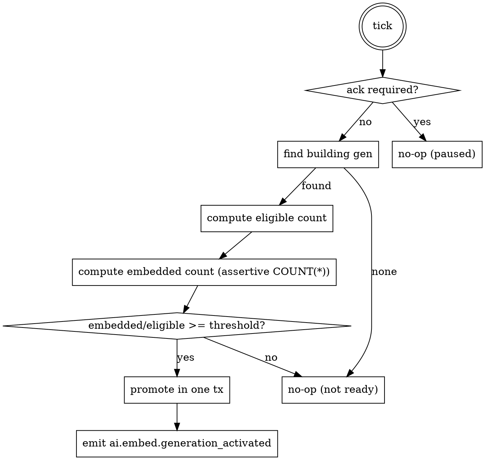

# Fotobank — AI Search v1 Design Spec

> **Status:** Brainstormed and locked 2026-05-01. Pending implementation plan.
>
> **Plan reference:** `~/code/msgvault` — `internal/vector/{backend,embed,sqlitevec,hybrid}` and `internal/query/sqlite_text.go` are the operational blueprint for fotobank's queue/worker/sqlite-vec/RRF stack. Fotobank diverges only where the substrate (existing `internal/ai/`, image-side embeddings, hidden-privacy gate) requires it.

## 1. Goal

Add hybrid (semantic + lexical) search to fotobank, exposed to the owner via the ⌘K-bound search bar in the SPA shell. v1 ships the full §7 surface from the web frontend design: free-text query, structured filter chips (date, tag, location, media type), sort modes (Relevance / Newest / Oldest), indexing-status pill that elevates to a banner under 80 % completeness, and an opt-in Diagnostics mode showing per-signal scores.

The substrate is image-side multimodal embeddings — one vector per photo's preview tier — fused at query time with FTS5 lexical matches over the AI-written caption, the active tags, the filename, the camera (make + model), the lens model, and the location label. RRF (k = 60) fuses both signals via a SQL composed query against the sqlite-vec backend.

## 2. Product principles

- **Beats Google Photos at curation, honestly.** Search results are ranked, but the score is debuggable when the user opts in. Indexing progress is visible, not hidden.
- **AI artifact storage rule (universal).** Every search result is fingerprint-aware: queries hit only the active embedding fingerprint's vectors and the current active AI tag/caption results. Stale fingerprints contribute nothing to the response.
- **Hidden privacy is preserved at the query layer.** A query without an unlock claim never returns a hidden photo and never leaks its existence through autocomplete or indexing-status counts.
- **Single-binary deploy preserved.** The new sqlite-vec dependency is a CGO bind, but everything ships in one Go binary built from one Makefile target.
- **Owner-only in v1.** Grantees see no AI search surface; the share routes do not project tags, captions, embeddings, or FTS rows. Cross-owner exposure is a separate later spec.

## 3. Architecture overview

Three new packages sit on top of the existing AI substrate. The AI write side (queue, worker, fingerprint, ack gate, gap scanner, health/SSE) extends to a third task; the search read side is its own subsystem under `internal/search/`.

- `internal/ai/embedding/` — gateway client targeting `/v1/embeddings`, embed worker, image preprocessing, activation coordinator. Shares `ai_jobs`, the ack gate, the fingerprint pattern, and the health/SSE surface with tag/caption. Worker code is separate because batching, request payload, and image preprocessing differ from the chat-completions worker.
- `internal/search/index/` — sqlite-vec backend (`Backend` interface mirroring msgvault), FTS5 maintenance, generations registry helpers.
- `internal/search/hybrid/` — RRF engine, query embedding, filter resolution. Adapts msgvault `hybrid/{rrf,filter,engine}.go`.
- `internal/service/search/` — auth-scoped wrapper enforcing owner scoping + hidden-gate semantics on every call. Symmetric with `internal/service/ai/`.
- `internal/httpapi/search.go` — search + autocomplete route handlers, alongside existing AI/album/share routes on the same mux.

Existing-package extensions (no new transport packages): `internal/cli/ai.go` (new subcommands for embed-task backfill/retry and generation lifecycle), `internal/obs/metrics.go` (extend AI metric labels with `task="embed"`, add embed/search-specific metrics).

## 4. Pre-step: DB driver migration

This lands as a separate sub-plan with its own review gate before any search work begins. **It is not purely mechanical.**

**Driver swap.** Replace `modernc.org/sqlite` with `mattn/go-sqlite3` + the sqlite-vec auto-extension (`github.com/asg017/sqlite-vec-go-bindings/cgo`). One driver registration across the app — no mixed `modernc` + `mattn` connections. CGO becomes part of the build pipeline; `make build`, `make build-release`, `make test`, and CI matrices update accordingly.

**Explicit verification surfaces.** Each of these is a tracked task in the migration sub-plan:

- DSN pragma format (`busy_timeout`, `foreign_keys`, `journal_mode`, `synchronous`) verified under the new driver. modernc's pragma application happens via DSN query string; mattn applies via per-connection `_busy_timeout=…&_fk=…` semantics — the connection-string format differs.
- Timestamp column scanning: mattn parses `time.Time` columns differently from modernc. Audit every `time.Time` scan path (`media.imported_at`, `media.timestamp`, `ai_results.generated_at`, the backup snapshot timestamps, etc.) and any nullable-time / timezone scanning. Add regression tests covering null-time and TZ round-trips.
- Busy-timeout and lock semantics under load — exercise the import + AI worker concurrent-write paths under a stress test before declaring the migration done.
- `internal/backup/` — fotobank's snapshot path uses `VACUUM INTO`, not the online-backup API; restore re-opens a standalone DB at the snapshot path. Both paths need verification under mattn's connection lifecycle and DSN handling. Standalone `SnapshotPath` DSNs in particular need the same pragma defaults as the live DB.
- `testutil.OpenTestDB(t)` registers the sqlite-vec extension exactly once per test process via a `RegisterExtension()` helper modeled on msgvault's pattern (`sync.Once`-guarded `sqlite_vec.Auto()` + driver registration).
- CI: CGO toolchain available on the runner, build cache configured, build cost budgeted (CGO compile is meaningfully slower; `make test-short` should still run in <60s).
- Cross-build expectations: `GOOS=linux GOARCH=amd64 go build` from a Mac requires a `CC` cross-compiler. Document the expected toolchain in CLAUDE.md so the next-time-you-deploy path is reproducible.
- Pre-commit hook chain: `golangci-lint` and `go test -shuffle=on` continue to work with CGO enabled. The `make test (short)` prek hook gets a one-time time-budget bump if needed.
- CLAUDE.md updated to reflect the new driver and CGO posture. The "no CGO" line is replaced by "SQLite via mattn/go-sqlite3 with sqlite-vec auto-extension; CGO enabled. One driver registration across the app."

The sub-plan ends with a green `make test` + `make build-release` + a manual smoke pass (import → reconcile → AI run → SPA load → backup snapshot → restore) before the search work begins.

## 5. Schema additions

All schema changes go into `000001_initial_schema.{up,down}.sql` in place per the pre-alpha policy. Up and down move together on every change.

### 5.1 Widen existing AI task constraints

The `task` CHECK constraint on `ai_jobs`, `ai_results`, `ai_failures`, and `ai_skipped` currently lists `('tag','caption')`. Widen to `('tag','caption','embed')`. Mirror in:

- `internal/ai/types.go` — extend the `Task` const set.
- The gap scanner's task iteration in `internal/ai/gapscanner/scanner.go`.
- SSE event names: add `ai.embed.completed`, `ai.embed.failed`, `ai.embed.generation_created`, `ai.embed.generation_activated`, `ai.embed.generation_retired`.
- The `aiHealthOutput` payload — third `EmbedTaskPart` block alongside Tag and Caption, plus a new `EmbeddingGenerations` block.
- CLI subcommand argument validation in `internal/cli/ai.go`.
- Any helper functions that switch on task.

This is a coordinated edit across roughly twelve sites. The plan tracks it as a single up-front task that lands before the schema migration is committed.

### 5.2 New `media.lens_model` column

Today's schema captures `make`, `model`, and `focal_length` but not a lens model. The §7 lexical-search surface promises a `lens` column, and indexing `focal_length` as if it were a lens name produces dishonest diagnostics. Per the pre-alpha edit-in-place policy, this is added directly to the `CREATE TABLE media` definition (and mirrored in the down file's reverse drop) — not via `ALTER TABLE`:

```sql
-- inside CREATE TABLE media (...)
lens_model        TEXT,
```

Populated at import time by reading the EXIF `LensModel` tag (`internal/exifread/`) and at reconcile time for existing rows on a one-time pass. `focal_length` stays as a separate column and is **not** included in the FTS corpus until a future structured focal-length filter requests it.

### 5.3 `embedding_generations` — registry of vec-table lifecycle

```sql
CREATE TABLE embedding_generations (
    id               INTEGER PRIMARY KEY AUTOINCREMENT,
    fingerprint      TEXT    NOT NULL UNIQUE,    -- serialized "<model_id>|<input_profile>" — diagnostic-readable
    fingerprint_hash TEXT    NOT NULL UNIQUE,    -- hex of the fingerprint hash; query path joins on this
    model_id         TEXT    NOT NULL,           -- denormalized for diagnostics
    input_profile    TEXT    NOT NULL,           -- denormalized for diagnostics
    vec_table_name   TEXT    NOT NULL UNIQUE,    -- e.g. "media_embeddings_g7"
    dimension        INTEGER NOT NULL,
    state            TEXT    NOT NULL CHECK(state IN ('building','active','retired')),
    embedded_count   INTEGER NOT NULL DEFAULT 0, -- cached counter; assertive recount runs at promotion
    threshold_pct    INTEGER NOT NULL DEFAULT 95,
    created_at       TIMESTAMP NOT NULL,
    activated_at     TIMESTAMP,
    retired_at       TIMESTAMP
);

CREATE UNIQUE INDEX embedding_generations_one_active
    ON embedding_generations(state) WHERE state = 'active';
CREATE UNIQUE INDEX embedding_generations_one_building
    ON embedding_generations(state) WHERE state = 'building';
```

`fingerprint`, `fingerprint_hash`, `model_id`, and `input_profile` are all denormalized so a row dump tells the operator immediately what was being indexed, without rehydrating from a hash table elsewhere. Partial unique indexes ensure at most one `active` and at most one `building` generation at any time.

### 5.4 Per-generation vec tables and the media-id mapping

`vec0` does not support `INSERT OR REPLACE` and prefers integer rowid keys (msgvault uses this same pattern in `internal/vector/sqlitevec/backend.go`). Two tables work together — one stable mapping from `media_id` to a per-generation integer `vec_id`, and one vec0 table keyed by that integer.

```sql
-- one row per (generation, media); vec_id is the rowid used inside the vec0 table
CREATE TABLE media_embedding_ids (
    generation_id INTEGER NOT NULL REFERENCES embedding_generations(id) ON DELETE CASCADE,
    media_id      UUID    NOT NULL REFERENCES media(id) ON DELETE CASCADE,
    vec_id        INTEGER NOT NULL,
    PRIMARY KEY (generation_id, media_id),
    UNIQUE (generation_id, vec_id)
);
CREATE INDEX media_embedding_ids_media_idx
    ON media_embedding_ids(media_id);
```

`vec_id` is allocated by the embedding worker as `MAX(vec_id)+1` per generation inside the same write transaction (or 1 when the table is empty for that generation). Per-generation virtual table:

```sql
CREATE VIRTUAL TABLE media_embeddings_g<id> USING vec0(
    vec_id INTEGER PRIMARY KEY,
    embedding FLOAT[<dim>]
);
```

**Write path (delete-then-insert; vec0 does not allow `INSERT OR REPLACE`).** Two cases — replacement of an existing vector and net-new write — are distinguished so `embedded_count` only ticks on net-new rows:

```sql
-- Step 1: take + drop any prior mapping for (generation, media), capturing the prior vec_id.
DELETE FROM media_embedding_ids
 WHERE generation_id = ? AND media_id = ?
RETURNING vec_id;
-- Returns 1 row (replacement) or 0 rows (net-new).

-- Step 2: drop the prior vec row if there was one.
DELETE FROM media_embeddings_g<id> WHERE vec_id = ?;     -- only if step 1 returned a row

-- Step 3: allocate a fresh vec_id (per-generation MAX+1, or 1 if empty).
-- Step 4: insert the new mapping + vec row.
INSERT INTO media_embedding_ids (generation_id, media_id, vec_id) VALUES (?, ?, ?);
INSERT INTO media_embeddings_g<id> (vec_id, embedding)              VALUES (?, vec_f32(?));
```

All statements run in one transaction with the `ai_jobs` status updates. `embedded_count` is incremented **only when step 1 returned no rows** — replacements (e.g. thumb regen on a media that already had a vector in this generation) are zero-delta. This keeps the cached counter honest about distinct embedded photos rather than total writes.

Allocation strategy for `vec_id`: per-generation `SELECT COALESCE(MAX(vec_id), 0) + 1 FROM media_embedding_ids WHERE generation_id = ?` inside the same transaction. Concurrent worker writes are serialized by SQLite's writer lock, so `MAX+1` is safe; under contention the second writer's `SELECT MAX` reads the first writer's committed row.

**Read path** (the FusedSearch composed query) joins `media_embedding_ids` ↔ `media_embeddings_g<id>` on `vec_id` and projects `media_id` for the result row.

The only safe-eval surface is `vec_table_name`, generated as `"media_embeddings_g" + strconv.FormatInt(id, 10)` — never user-supplied. The retire path drops the vec table on the compaction window expiry; the `embedding_generations` row + its `media_embedding_ids` rows stick around with `state='retired'` until compaction removes both atomically (the FK cascade from `embedding_generations.id` handles `media_embedding_ids` cleanup automatically).

### 5.5 `media_fts` — FTS5 lexical index

Standalone (no `content=` attachment), six columns matching the §7 corpus. `camera` concatenates `media.make || ' ' || media.model`; `lens` reads `media.lens_model`.

```sql
CREATE VIRTUAL TABLE media_fts USING fts5(
    media_id UNINDEXED,
    caption_text,
    tag_label,
    filename,
    camera,
    lens,
    location_label,
    tokenize = 'porter unicode61 remove_diacritics 2'
);
```

**No regular index on `media_fts(media_id)`** — FTS5 virtual tables don't accept secondary indexes. Point updates use delete-then-insert by `media_id`:

```sql
DELETE FROM media_fts WHERE media_id = ?;
INSERT INTO media_fts (media_id, caption_text, tag_label, filename, camera, lens, location_label)
       VALUES (?, ?, ?, ?, ?, ?, ?);
```

Both run inside the same write transaction. Delete-by-`media_id` is acceptable for v1 because refresh volume is bounded by import / reconcile / AI-worker pace — refreshes do not happen on every keystroke. The documented escape hatch if profiling shows refresh cost dominating: introduce a small `media_fts_rowids(media_id, rowid)` mapping table and switch deletes to `WHERE rowid = ?`.

### 5.6 FTS maintenance — application-owned refresh

Triggers fire in arbitrary order relative to multi-table writes; racing the caption / tag promotion transaction is fragile. The maintenance path is application-owned instead:

- `internal/search/index.RefreshMediaFTS(tx, mediaID)` is the single entry point. It reads the current state of `media`, the active caption (`ai_results` joined to `media_captions` where `task='caption'` and `status='active'`), and the active tags (`ai_results` joined to `media_tags` where `task='tag'` and `status='active'`, ordered by `rank`). It computes the six-column row and runs the delete-then-insert.
- The AI worker's success transaction calls `RefreshMediaFTS` as its final write, inside the same transaction that promoted the result to active.
- The importer calls `RefreshMediaFTS` after `media` row insertion so newly-imported photos appear in FTS immediately, even before AI runs.
- Reconcile and any media-update path that touches `make`, `model`, `lens_model`, `original_filename`, or `location_label` calls `RefreshMediaFTS`.

The only schema-side trigger is a cleanup-only `AFTER DELETE ON media`:

```sql
CREATE TRIGGER media_fts_cleanup_after_delete
AFTER DELETE ON media
FOR EACH ROW
BEGIN
    DELETE FROM media_fts WHERE media_id = OLD.id;
END;
```

### 5.7 Search-supporting indexes — minimal, no duplication

The structured filters in §7 are date, tag, location, media type. Existing indexes already cover the date dimension (`media_owner_timestamp_idx`, `media_visible_idx`). Tag-filter resolution joins through `media_tags` (already indexed via `media_tags_key_idx`). Location resolution is **exact-match** against `location_label` (the chip carries a label resolved through the autocomplete endpoint; substring matching lives only in autocomplete). Equality on `location_label` is cheap at personal-library scale, no new index. Only the missing media-type index is added:

```sql
CREATE INDEX media_owner_type_idx
    ON media(owner_hub, owner_user_id, media_type)
    WHERE hidden_at IS NULL;
```

Hidden-context queries (rare, after explicit unlock) don't get a partial — full scan is cheap because the unlocked-Hidden surface filters down to a much smaller row set first.

## 6. Indexing pipeline

### 6.1 `imginput` refactor

Today `internal/ai/imginput/resolver.go::ResolveAndEncode` bakes the chat-task profile (`jpeg-1024-q85-…`) into the resolver. The pre-step refactor splits responsibilities:

- `imginput.ResolvePreviewJPEG(ctx, mediaID) ([]byte, status)` — shared primitive that fetches the raw preview-tier JPEG from storage. No re-encoding, no metadata stripping.
- `internal/ai/imginput/encode/encode.go` — task-specific encoders. `EncodeChat(jpg) ([]byte, error)` is the existing chat-task pipeline (1024-edge resize, q85 reencode, metadata strip). `EncodeEmbed(jpg, edge int) ([]byte, error)` is the new embed-task pipeline (configurable edge, q85, metadata strip).

Existing call sites in the chat worker switch from `ResolveAndEncode` to `ResolvePreviewJPEG` + `EncodeChat`. This refactor lands as its own task before the embed worker is wired.

### 6.2 Embed input profile

The triple `(model_id, "" /* no prompt */, "jpeg-<edge>-q85-metadata-stripped-embed-v1")` makes up the embed fingerprint. Default `edge=384` gives a profile string of `"jpeg-384-q85-metadata-stripped-embed-v1"`. Diagnostic-readable; not just an opaque hash.

### 6.3 Gateway client

`internal/ai/embedding/client.go` targets `/v1/embeddings`. Request shape (fotobank's "OpenAI-shaped" embedding contract — modeled after vllm/lmdeploy convention; native providers like Voyage or Cohere whose request body differs require an adapter/proxy):

```json
{ "input": ["data:image/jpeg;base64,<bytes>", "..."], "model": "<embed_model_id>" }
```

Response is the standard OpenAI-compat object envelope:
```json
{
  "data": [
    { "embedding": [0.123, -0.456, ...], "index": 0 },
    { "embedding": [...], "index": 1 }
  ],
  "model": "<embed_model_id>"
}
```
The `data` array preserves input order via the `index` field. The client validates that each returned vector's dimension matches the configured `[ai.embed].dimension`; mismatched dimensions fail the batch with `ErrKindMalformed` (re-running won't help — it's a config drift).

The same client also embeds plain text queries at search time:

```json
{ "input": ["small dog on a beach"], "model": "<embed_model_id>" }
```

**The configured embed model must produce shared image-text embeddings** (CLIP / SigLIP-family). At server boot a startup probe validates **modality support and dimension**: one image data URL and one short text string are sent and each response is checked for a vector at the configured dimension. The probe cannot prove that the two vectors live in a meaningfully aligned latent space — that is a model contract, documented in the operator's chosen model card, not something fotobank can verify. Boot fails with a clear error if either modality fails to return a vector at the expected dimension; alignment is the operator's responsibility.

Failure classification mirrors the chat-completions client: 4xx → permanent (`provider_4xx`), 429 + 5xx → transient (retried per `[ai.embed].max_retries`, default 1), network/timeout → transient.

### 6.4 Worker

`internal/ai/embedding/worker.go` is its own implementation. Shares `ai_jobs`, the ack gate, the fingerprint pattern, the gap scanner orchestration, and the health/SSE surface; differs in batching shape, request payload, and image preprocessing.

Loop:

1. Pull up to `[ai.embed].batch_size` (default 32) pending jobs in one claim transaction.
2. For each job, resolve the photo's preview bytes via `imginput.ResolvePreviewJPEG`. Skip semantics:
   - `thumb_status='no_preview'` → record `ai_skipped(reason='no_preview')`, complete job.
   - `thumb_status IN ('pending','working','failed')` → block; the job stays in the queue and the gap scanner re-enqueues it once thumb_status flips to `ready`.
   - `thumb_status='ready'` with a missing or unreadable preview blob → retryable failure (`ErrKindMissingBlob` or `provider_4xx`-classed failure). Counted against the per-photo retry budget. Not a skip — the DB says the blob should exist.
3. Preprocess the batch in parallel via `EncodeEmbed` (CPU-bound; bounded by GOMAXPROCS).
4. Issue one batched `/v1/embeddings` call.
5. Write vectors into the target generation using the §5.4 delete-then-insert pattern (`media_embedding_ids` mapping write + `media_embeddings_g<id>` row write per photo), all batched in one transaction with the `ai_jobs` status updates. The cached `embedded_count` is updated by the §5.4 net-new-only delta — replacements (e.g. re-embed of an already-mapped media in this generation) are zero-delta; only mappings whose `DELETE ... RETURNING vec_id` returned no row tick the counter.
6. On partial failure (some response indices missing): re-run the failed indices as singles to attribute the failure to specific photos.
7. On full-batch failure: mark every job in the batch as failed with `attempts++`; the queue's existing per-photo retry budget logic applies.

### 6.5 Generation targeting

Each `ai_jobs` row carries the fingerprint it was enqueued against (the existing `fingerprint` column already does this). The worker resolves `embedding_generations` by `fingerprint_hash`:

- If a generation row exists in state `building` or `active` for that fingerprint, write to that generation's vec table.
- If neither exists (config fingerprint just changed, gap scanner hasn't run yet), the worker creates the `building` generation row + vec table on the spot inside its transaction. `INSERT OR IGNORE` on the unique index ensures only one creator wins under concurrent worker contention.

The cached `embedded_count` on the target generation row is updated by the §5.4 net-new delta — incremented only when the write produced a new mapping; replacements are zero-delta.

### 6.6 Embed gap scanner predicate

The existing tag/caption gap scanner predicate checks `WHERE NOT EXISTS (active ai_results)`. Embed cannot reuse it — the source of truth is the per-generation vec table, not `ai_results`. The embed predicate (one query per scanner pass):

```sql
SELECT m.id FROM media m
 WHERE m.owner_hub = ? AND m.owner_user_id = ?
   AND m.thumb_status = 'ready'
   AND (m.hidden_at IS NULL OR ?)             -- ack_allows_hidden
   AND NOT EXISTS (
     -- Vector present in the active-or-building generation? Check goes
     -- through the mapping table; the vec0 table itself only carries vec_id.
     SELECT 1 FROM media_embedding_ids x
      WHERE x.generation_id = ? AND x.media_id = m.id
   )
   AND NOT EXISTS (
     SELECT 1 FROM ai_skipped s
      WHERE s.media_id = m.id AND s.task = 'embed'
   )
   AND NOT EXISTS (
     SELECT 1 FROM ai_failures f
      WHERE f.media_id = m.id AND f.task = 'embed'
        AND f.model_id = ? AND f.prompt_version = '' AND f.input_profile = ?
        AND f.attempt_count >= ?               -- retry budget
   )
   AND NOT EXISTS (
     SELECT 1 FROM ai_jobs j
      WHERE j.media_id = m.id AND j.task = 'embed'
        AND j.status IN ('pending','working','blocked')
   )
 ORDER BY m.id
 LIMIT ?
```

The active-or-building generation id is resolved once per scanner pass and bound as the `?` to `x.generation_id`. The check is mapping-only — proving `media_embedding_ids` has a row for `(generation_id, media_id)` is sufficient because the §5.4 write path never inserts a mapping row without an accompanying vec row in the same transaction. Two separate scanner queries: one for tag/caption (existing), one for embed (new).

### 6.7 Auto-enqueue triggers

- **On import.** Alongside the existing tag + caption enqueue in the importer, add embed enqueue. The existing pattern is: jobs enqueue regardless of thumb readiness, the worker `MarkBlocked`s a job whose preview isn't ready (last_error tagged `thumb_blocked`), and the housekeeping tick calls `Queue.PromoteThumbReadyBlocked(ctx, task)` to flip blocked → pending once the thumb worker reports the row ready. Embed reuses this pattern verbatim — extend the housekeeping promotion call to iterate `embed` alongside `tag` and `caption`.
- **On thumb regen** (`thumb_version` bump). For every non-retired generation `g` (both `active` and `building` rows might hold a vector for the same media during a swap):
  1. `DELETE FROM media_embedding_ids WHERE generation_id = g AND media_id = ? RETURNING vec_id` — yields zero or one row.
  2. If a row was returned: `DELETE FROM media_embeddings_g<g> WHERE vec_id = ?` to drop the corresponding vec row, and **decrement** the cached `embedded_count` on generation `g` by 1.
  3. Re-enqueue the embed job.

  There is no `stale` analogue for vectors; during the rebuild window for a single photo, that photo is absent from the vector index (lexical-only). Cheap and simple.
- **On config fingerprint swap.** The gap scanner notices a fingerprint with no active or building generation and creates a fresh `building` generation. The scanner then enqueues embed jobs for every eligible media against the new generation.
- **On model swap mid-build.** If the user changes config again while a build is in progress, the in-progress building generation gets retired (no activation). A new building generation is created against the new fingerprint, and the gap scanner re-enqueues. The retired-but-never-activated generation's vec table is dropped on the next compaction sweep.

### 6.8 Activation coordinator

`internal/ai/embedding/activator.go` runs as a small periodic tick (default 30 s) inside the AI worker process.

**Single-principal scope (v1).** Embedding generations are global (one active vec table at a time across the whole DB), but eligibility and activation are evaluated against a **single configured principal** — the stub-mode owner registered in `[identity.stub]`. This matches phase 1 of the master vision (`identity.mode = "stub"`) and the existing AI-worker assumption. Multi-principal activation (where one owner can't cross the threshold while another is mostly unindexed) is explicitly deferred to the same future spec that activates multi-principal AI workers more broadly.



Eligible-count SQL (explicit parens, owner-scoped, ack-aware):

```sql
SELECT COUNT(*) FROM media m
 WHERE m.owner_hub = ? AND m.owner_user_id = ?
   AND m.thumb_status = 'ready'
   AND (m.hidden_at IS NULL OR ?)             -- ack_allows_hidden
   AND NOT EXISTS (
     SELECT 1 FROM ai_skipped s
      WHERE s.media_id = m.id AND s.task = 'embed'
   )
```

Embedded-count is an assertive query against the **mapping table joined back to eligible media** — counting raw vec rows would let orphaned vec rows (stale rowids from prior crashes), as well as future owner/hidden drift, contribute to the threshold and promote too early:

```sql
SELECT COUNT(*) FROM media_embedding_ids x
 JOIN media m ON m.id = x.media_id
 WHERE x.generation_id = ?
   AND m.owner_hub = ? AND m.owner_user_id = ?
   AND m.thumb_status = 'ready'
   AND (m.hidden_at IS NULL OR ?)             -- ack_allows_hidden, same value as the eligible query
   AND NOT EXISTS (
     SELECT 1 FROM ai_skipped s
      WHERE s.media_id = m.id AND s.task = 'embed'
   )
```

The cached `embedded_count` is for runtime telemetry only; activation always recounts assertively against the same predicate as the eligible query so numerator and denominator agree exactly.

Promotion is one transaction:

```sql
BEGIN;
UPDATE embedding_generations SET state='retired', retired_at=now WHERE state='active';
UPDATE embedding_generations SET state='active', activated_at=now WHERE id=<building_id>;
COMMIT;
```

The activator honors the ack gate **explicitly**: if the configured principal is in `acknowledgement_required`, the activator no-ops every tick and stamps `paused_reason: "acknowledgement_required"` into the health payload's embedding-generation block. This prevents an over-95 % building generation (vectors written before a revoke) from being silently activated while workers are parked.

### 6.9 Rollback / promote-from-retired

Operator escape hatch. `fotobank ai promote-generation <id>` (admin-only) does the inverse — retires the current active, promotes the named retired generation back to active. Within the 30-day compaction window, this is non-destructive. After the window the vec table is gone and rollback requires a full reindex.

### 6.10 Retired-generation compaction

Retired rows + their vec tables stay for `[search] retain_retired_days` (default 30). A background sweep — invoked from the AI worker's housekeeping tick — drops vec tables and deletes `embedding_generations` rows whose `retired_at < now - retain_retired_days`. Manual invocation: `fotobank ai compact-retired-generations [--dry-run]`.

## 7. Query path

### 7.1 HTTP route

```
GET /api/v1/search
  ?q=small+dog+on+a+beach
  &sort=relevance
  &date_after=2025-01-01T00:00:00Z
  &date_before=2025-07-01T00:00:00Z
  &tag=dog&tag=beach                     // repeated; AND-composed
  &location=Paris,%20France              // exact resolved label from autocomplete
  &media_type=photo                      // photo | video | (omitted for any)
  &limit=60
  &cursor=<opaque>                       // from prior response; null/omitted on first page
  &include_hidden=false                  // requires unlock claim if true; 403 generic otherwise
  &explain=false                         // diagnostics mode; honored only if user_settings says so
```

Stable query params (no opaque `filters=` blob) — the SPA URL is shareable, bookmarkable, and not coupled to the cursor.

Response:

```jsonc
{
  "results": [{
    "media_id":      "...",
    "media_type":    "photo",            // "photo" | "video"
    "timestamp":     "2025-04-12T18:30:11Z",  // null if EXIF lacked a capture date
    "imported_at":   "2025-04-12T19:02:55Z",  // never null; date-sort tiebreaker
    "width":         4032,                 // null when EXIF lacked dimensions; client falls back to a default aspect
    "height":        3024,
    "thumb_version": 3,
    "score":         0.0156,            // present on relevance sort
    "score_components": {                // present iff explain=true and user_settings allows
      "rrf":     0.0156,
      "bm25":    8.42,                   // null if missing from this signal
      "vector":  0.81,                   // null if missing
      "rank_bm25":   3,                  // null if missing
      "rank_vector": 7                   // null if missing
    }
  }],
  "next_cursor": "...",                  // null when no more
  "has_more":    true,
  "total":       142,                    // present only on filter-only or date-sorted queries
  "effective_sort":                "newest",  // echoes the sort actually applied; differs from the
                                         // request's `sort` ONLY when the server coerced
                                         // q == "" && sort == "relevance" → "newest" (§7.3 step 1).
                                         // Semantic fallback (no active generation, query embed
                                         // failed) does NOT change effective_sort — it surfaces
                                         // through semantic_unavailable + semantic_unavailable_reason.
  "embedding_completeness": 0.97,        // active generation embedded/eligible — computed under
                                         // the same hidden predicate as the request
  "semantic_unavailable":          false,// true when no active generation OR query embedding failed
  "semantic_unavailable_reason":   ""    // "" | "no_active_generation" | "query_embedding_failed"
}
```

The result row embeds everything the existing justified-row grid needs to render a cell directly — `media_type`, `width`/`height` (for `aspect = width/height` per `frontend/src/lib/grid/justifiedLayout.ts`), `timestamp` and `imported_at` for date-sort cursor stability, and `thumb_version` for cache-busting the thumb URL. No N+1 follow-up `/api/v1/media/{id}` fetch per cell. The full media payload (EXIF, GPS, AI tags + caption) is fetched only when the user opens a result in the lightbox.

**Hidden-aware count semantics.** `embedding_completeness` is computed under the **same hidden predicate** as the request that produced it. A request without unlock claim sees `embedded / eligible` over visible photos only; a request with `include_hidden=true` plus unlock claim sees the count over all photos. The numerator and denominator must agree on the predicate so the pill never reveals hidden-only embedding progress to a locked session.

### 7.2 Service layer

`internal/service/search/service.go` is the auth boundary. Every call:

1. Resolves the caller via the existing identity middleware.
2. Validates `include_hidden=true` against the unlock claim — 403 generic if missing (same pattern as `MediaView`).
3. Builds the structured filter (`internal/search/hybrid/filter.go`, adapted from msgvault) — resolves tag chip strings to `tag_key` IDs, normalizes dates, owner-scopes everything.
4. Calls `internal/search/hybrid.Engine.Search`.

### 7.3 Hybrid engine

Decision tree per request, structured **sort-first**: the top-level branch is the effective sort, with semantic-availability sub-cases nested inside each branch. This keeps the cursor shape and `semantic_unavailable_*` fields disjoint per branch and avoids one branch quietly overriding another.

**Step 1 — coerce relevance-without-query.** Before branching, the server coerces `q == "" && sort == "relevance"` to `sort = "newest"` and emits `effective_sort = "newest"` in the response (the only case where `effective_sort` differs from the request's `sort`). Relevance has no defined meaning without a query string; rather than 400 the request the server picks the most useful default. The frontend defaults away from this combination on its own; the coercion is a defensive fallback for direct-API callers and bookmarked URLs.

**Step 2 — branch on `(q, effective_sort)`:**

- **`q == ""`** (effective_sort is always `"newest"` or `"oldest"` after step 1) → **filter-only browse.** Single SQL query against `media` with the structured filter, ordered by `(timestamp NULLS LAST, imported_at, id)`. No FTS5, no ANN, no scoring. `semantic_unavailable = false` (the field is moot when no semantic signal is requested). Cursor is `(timestamp_nulls_last, imported_at, id)`.

- **`q != "" && effective_sort == "relevance"`** → **relevance-ranked.** Sub-cases:
  - **active generation present, query embedding succeeds** → hybrid. Embed `q` once via the embedding client; build the FTS5 MATCH expression (§7.4); call `Backend.FusedSearch` (the sqlite-vec capability) with both signals + filter. Returns RRF-ordered hits. `semantic_unavailable = false`. Cursor is `(rrf_score, media_id)`.
  - **no active generation** → BM25-only. Same FTS5 MATCH expression, no vector signal. `semantic_unavailable = true`, `semantic_unavailable_reason = "no_active_generation"`. Cursor is `(bm25_score, media_id)`.
  - **active generation present but `/v1/embeddings` fails for the query** (timeout, 5xx, network error) → degrade to BM25-only. `semantic_unavailable = true`, `semantic_unavailable_reason = "query_embedding_failed"`. Cursor is `(bm25_score, media_id)`. The whole request must not 500 just because the embedding endpoint is down — lexical results are still useful and arguably more deterministic. The error is logged once per request with the response code/body. The frontend banner copy distinguishes this from `no_active_generation`.

- **`q != "" && effective_sort != "relevance"`** → **date-sorted candidate selection.** The candidate pool depends on which signals are available, mirroring the relevance branch's sub-cases:
  - **active generation present, query embedding succeeds** → hybrid candidate selection (RRF top-K from BM25 + ANN, `KPerSignal * 2` per signal so the date sort has enough candidates to fill the page cleanly), then re-sort by `(timestamp NULLS LAST, imported_at, id)` for the page. `semantic_unavailable = false`.
  - **no active generation** → BM25-only candidate selection, then date-sort. `semantic_unavailable = true`, `semantic_unavailable_reason = "no_active_generation"`.
  - **active generation present but `/v1/embeddings` failed for the query** → BM25-only candidate selection, then date-sort. `semantic_unavailable = true`, `semantic_unavailable_reason = "query_embedding_failed"`.

  In all three sub-cases the cursor is the date-sort tuple `(timestamp_nulls_last, imported_at, id)` (not the relevance-sort cursor), and `effective_sort` echoes back `"newest"` or `"oldest"` as requested.

`KPerSignal` (default 200), `RRFK` (default 60), and the per-signal limits are config-tunable under `[search]`.

**Important wording.** `Backend.FusedSearch` is fotobank's composed SQL query against the sqlite-vec backend, not a native sqlite-vec primitive. sqlite-vec exposes KNN with filterable metadata/partition columns; tag and location filters are CTE-composed by our engine on top of the KNN result. A regression test covers a highly selective tag + location filter — the test fails if ANN overfetch starves the result set before the filter intersects it. The engine widens `KPerSignal` adaptively when filter cardinality is low, or falls back to filter-first SQL.

### 7.4 FTS5 query construction

- Tokenize `q` by whitespace, drop tokens shorter than 2 chars, escape FTS5-meaningful characters (`"`, `*`, `(`, `)`, `:`, `^`).
- Wrap each completed token in double quotes (treat as phrase token, prevents prefix-search interpretation): `"small" AND "dog" AND "beach"`.
- **Trailing-prefix on the final incomplete token** when `q` does not end in whitespace: `"small" AND "dog" AND "be"*`. Makes ⌘K feel responsive; bounded scope (no general prefix expansion elsewhere in the query).
- Tokens that escape to empty (e.g. `q="!! "`) fall through to filter-only browse with `q` treated as empty.

### 7.5 Filter resolution

- **Date range.** Half-open `WHERE m.timestamp >= ? AND m.timestamp < ?`. Either bound optional.
- **Tags.** Each `tag_key` becomes one EXISTS clause:
  ```sql
  EXISTS (SELECT 1 FROM media_tags mt
           JOIN ai_results r ON mt.result_id = r.id
          WHERE r.media_id = m.id AND r.task = 'tag' AND r.status = 'active'
            AND mt.tag_key = ?)
  ```
  Multiple tag chips are AND-composed.
- **Location.** Exact-match `WHERE m.location_label = ?` against the chip's resolved label. Substring matching belongs in the autocomplete endpoint, not the committed filter chip.
- **Media type.** `WHERE m.media_type = ?`.
- **Hidden.** `WHERE m.hidden_at IS NULL` unless `include_hidden=true` AND the unlock claim is present.

Filters are pushed into the FusedSearch SQL as a CTE that intersects with both the BM25 and ANN per-signal candidate lists before RRF.

### 7.6 Cursor encoding

Opaque base64-encoded JSON:

```jsonc
{
  "req_hash": "<sha256-hex>",   // hash of normalized request
  "k1":       0.0156,           // primary sort key (rrf_score / bm25_score / timestamp epoch)
  "k2":       1737562800,       // secondary (e.g. imported_at epoch for date sorts; null for relevance)
  "id":       "<uuid>"          // tiebreaker
}
```

The normalized-request hash covers `q` (lowercased, trimmed), serialized filters (sorted keys), the **effective sort** (i.e. after the §7.3 `q == "" && sort == "relevance"` coercion to `"newest"`; not the raw request sort), `include_hidden`, and the engine mode (`hybrid` / `bm25_only` / `filter_only`). Hashing the effective sort instead of the raw value keeps pagination semantics unambiguous after coercion: a cursor minted on the first page (where the server coerced) decodes cleanly on the next page (where the client may have updated its UI to send `"newest"` directly). The decoder rejects mismatches with HTTP 400 instead of silently re-paginating a different query.

For date sorts the cursor key tuple matches the repo's real ordering: `(timestamp NULLS LAST, imported_at, id)`. The cursor carries all three.

Cursor stability across generation activations: scores may shift mid-pagination on activation. The client just renders whatever comes back. SSE `ai.embed.generation_activated` invalidates the search store's `requestHash` so the next user interaction restarts from cursor=null cleanly.

### 7.7 Performance budget

Target: **P50 < 200 ms, P95 < 500 ms** for hybrid queries on a 100k-photo library. The composed FusedSearch executes BM25 + ANN + filter intersection in one SQL statement; overhead is one `/v1/embeddings` call (~50 ms typical) plus the SQL execution (~50–150 ms typical). No multi-step Go orchestration in the hot path.

## 8. Frontend surfaces

### 8.1 Search route + store

New SPA route `/search?q=...&sort=...&...` consuming the existing virtualized grid for result rendering. State lives in a Svelte 5 `searchStore.svelte.ts`:

- `query: string` (bound to the AppHeader search input)
- `filters: SearchFilters` (date range, tag chips, location chip, media_type)
- `sort: 'relevance' | 'newest' | 'oldest'`
- `results: SearchResult[]` (cumulative across pagination pages)
- `cursor`, `hasMore`, `total`
- `embeddingCompleteness`, `semanticUnavailable` (drives the banner / pill)
- `requestHash` (mirrors the cursor's hash; cleared when query / filters / sort change)

Pagination is on-scroll-near-bottom, reusing the existing virtualized grid's intersection observer. `ai.embed.generation_activated` SSE invalidates `requestHash` and triggers a single refetch from cursor=null on the user's next interaction (no auto-refetch — would yank the scroll position).

### 8.2 AppHeader search input

`frontend/src/lib/components/AppHeader.svelte` is the source of truth for the search input. ⌘K already focuses this input today.

On input:

- Debounce API and search-route updates by ~300 ms.
- Flush immediately on Enter.
- While typing, use `router.navigate(..., { replace: true })` so history does not get one entry per keystroke.
- Push a normal history entry only when entering search from another route or when the user commits with Enter.
- Cancel in-flight search requests when the request hash changes.

### 8.3 Router

`frontend/src/lib/router/router.svelte` gets an explicit `/search` match plus query-param parsing. The route handler reads `q`, `sort`, `date_after`, `date_before`, repeated `tag`, `location`, `media_type` and seeds the search store.

### 8.4 Filter popover

`SearchFiltersPopover.svelte`:

- Date range: two `<input type="date">` controls; half-open semantics. Each chip below the popover renders the resolved range.
- Tag picker: text input that calls `/api/v1/search/autocomplete/tags?q=...`. Selecting a result commits a chip carrying the exact `tag_key`.
- Location: text input calling `/api/v1/search/autocomplete/locations?q=...`. Selecting commits a chip carrying the exact resolved `location_label`.
- Media type: segmented control (`Photo` / `Video` / `Any`).

Chips below the popover are removable; clicking one reopens the popover with that chip's value pre-filled for in-place adjustment.

### 8.5 Sort segment

Segmented control: `Relevance | Newest | Oldest`. Defaults to Relevance when `q != ""`, Newest otherwise. Switching sort mid-query restarts pagination (cursor mismatch on hash).

### 8.6 Indexing status, two-tier (per §7)

- **Pill** in the search header: `2,143 / 2,981 indexed` — visible whenever `embeddingCompleteness < 1.0`. Hidden once fully indexed.
- **Banner** above the results when `q != "" && embeddingCompleteness < 0.80 && !semanticUnavailable`. Banner text: *"Search is still indexing — semantic ranking covers X % of your library so far. Lexical results below."*
- **Unavailable banner — `no_active_generation`**: *"Semantic search is not yet available — your library is still being indexed for the first time."* One-time-dismissable per session.
- **Unavailable banner — `query_embedding_failed`**: *"Semantic ranking is temporarily unavailable. Showing lexical results."* Auto-dismisses on the next successful query.

The pill / banner reads from the search response payload directly, not from a separate health poll. Because both fields (`embedding_completeness`, `semantic_unavailable_reason`) come from the same hidden-aware service-layer call as the result rows, the pill never reveals hidden-only embedding progress to a locked session.

### 8.7 Diagnostics mode

Settings → "AI Inspection" toggle, persisted via `user_settings`. When enabled, search requests pass `explain=true` and result cells render a small score badge (RRF) on hover; the lightbox info panel grows a "Search relevance" row with per-signal scores + per-signal ranks. Off by default; power-user surface. No `?explain=1` query-string override in v1 (would leak diagnostics through copied URLs).

## 9. Autocomplete endpoints

**Both autocomplete endpoints honor the same hidden-context rules as the search route.** A request omits `include_hidden` (or sends `false`) and counts/labels are computed against visible-only media. A request with `include_hidden=true` requires a valid unlock claim; missing claim returns 403 generic. This applies to **tag autocomplete as well as location autocomplete** — without unlock, neither hidden-only tag occurrences nor hidden-only locations leak through suggestion counts or membership.

**LIKE-input escaping.** The user-typed prefix/substring is run through a small escaper that doubles `%` and `_` and prefixes them with a backslash, then issues `LIKE ? ESCAPE '\'`. This prevents an injected wildcard from widening the match silently. (Same pattern the existing media filter substring matchers use.)

### 9.1 Tag autocomplete

```
GET /api/v1/search/autocomplete/tags?q=<prefix>&limit=10&include_hidden=false
```

Returns up to 10 tag suggestions matching the escaped prefix (case-insensitive `LIKE 'q%' ESCAPE '\'`):

```jsonc
{ "tags": [
    { "tag_key": "dog",   "tag_label": "Dog",   "count": 142 },
    { "tag_key": "doggo", "tag_label": "doggo", "count": 7   }
] }
```

Owner-scoped. Resolved against `media_tags` joined to `ai_results` where `task='tag' AND status='active'`, plus a join to `media` carrying the hidden predicate. Counts are computed over the visible (or visible+hidden under unlock) subset. Deduped by `tag_key`, ordered by occurrence count descending. The chip stores `tag_key`; the UI renders `tag_label`.

### 9.2 Location autocomplete

```
GET /api/v1/search/autocomplete/locations?q=<substring>&limit=10&include_hidden=false
```

Returns up to 10 distinct `location_label` values matching the escaped substring (case-insensitive `LIKE '%q%' ESCAPE '\'`):

```jsonc
{ "locations": [
    { "location_label": "Paris, France",      "count": 68 },
    { "location_label": "Paris, Texas, USA",  "count": 3  }
] }
```

Owner-scoped, hidden-aware via the same `include_hidden` + unlock-claim rule.

Both endpoints are cheap and cached client-side per session.

## 10. CLI surface

Extends `internal/cli/ai.go`:

- `fotobank ai backfill --task embed [--force]` — re-enqueues missing-fingerprint embed jobs. `--force` re-enqueues even where a current-fingerprint vector exists (testing aid).
- `fotobank ai retry-failed --task embed`
- `fotobank ai retry-photo <media_id> --task embed`
- `fotobank ai list-generations [--state active|building|retired]` — JSON output for diagnostics. Lists `id`, `fingerprint`, `model_id`, `input_profile`, `state`, `dimension`, `embedded_count`, `eligible_count`, `created_at`, `activated_at`, `retired_at`.
- `fotobank ai promote-generation <id>` — admin override; promotes a retired generation back to active. Logs a warning if the target generation is older than the compaction window.
- `fotobank ai compact-retired-generations [--dry-run]` — manual compaction; the housekeeping tick does this automatically on `[search] retain_retired_days`.

## 11. SSE events

Extends the existing `ai.*` channel:

- `ai.embed.completed { media_id, fingerprint }` — fires on every successful embed write.
- `ai.embed.failed { media_id, fingerprint, error_kind }` — fires on every embed failure beyond retry budget.
- `ai.embed.generation_created { id, fingerprint }` — fires when the worker creates a building generation.
- `ai.embed.generation_activated { id, fingerprint }` — fires after promotion. Search store invalidates on this.
- `ai.embed.generation_retired { id, fingerprint }` — fires after retirement (informational; no UI action).

Existing health-changed events fold the third task naturally; no new channel.

## 12. Metrics

`internal/obs/metrics.go` extensions. **Existing AI metrics extend with `task="embed"`** rather than minting new metric names — preserves dashboard continuity:

- `fotobank_ai_jobs_depth{task="embed",status="..."}` (gauge, existing pattern)
- `fotobank_ai_jobs_completed_total{task="embed"}` (counter, existing pattern)
- `fotobank_ai_request_duration_seconds{task="embed",outcome="..."}` (histogram, existing pattern)

Embed/search-specific new metrics:

- `fotobank_ai_embed_batch_size` (histogram of batch sizes actually sent — useful for tuning `batch_size`)
- `fotobank_ai_embedding_generations{state="active|building|retired"}` (gauge)
- `fotobank_ai_embedding_count{state="active|building"}` (gauge — embedded count for active and building)
- `fotobank_search_requests_total{mode,sort}` (counter; modes: `hybrid`, `bm25_only`, `filter_only`)
- `fotobank_search_latency_seconds{mode}` (histogram)
- `fotobank_search_pool_saturated_total` (counter — fires when `KPerSignal` hits its cap, signaling a need to widen)

## 13. Configuration

New config block, sourced from the same TOML the existing `[ai.*]` blocks live in:

```toml
[ai.embed]
enabled            = true
model              = "google/siglip2-base-patch16-384"   # configurable; must produce shared image-text embeddings
endpoint           = "http://localhost:8080/v1"           # OpenAI-compat embeddings endpoint
api_key_env        = ""                                    # optional env var name carrying a bearer token (hosted endpoints)
dimension          = 768                                   # validated at boot
input_edge         = 384                                   # JPEG resize edge before base64 encoding
worker_concurrency = 1
batch_size         = 32
max_retries        = 1
timeout            = "10s"

[search]
k_per_signal         = 200
rrf_k                = 60
retain_retired_days  = 30
activation_threshold = 95   # percent
```

`api_key_env` is added to `[ai.embed]` and mirrors the existing `[ai.vision].api_key_env` field (already present today as `VisionConfig.APIKeyEnv` in `internal/ai/config.go`). Empty disables the `Authorization` header (the local-inference default); non-empty names an env var whose value is sent as `Authorization: Bearer <value>`. The new embed-side field reuses the same `APIKeyEnv` resolution helper.

The `[ai.vision]` block (existing, drives the chat-completions gateway) and `[ai.embed]` block coexist; they may point at the same endpoint or different endpoints. Boot-time validation: a modality + dimension probe sends one image data URL and one short text string to `[ai.embed].endpoint`, requires both responses to come back with vectors at the configured `dimension`, and aborts startup with a clear message on failure. Shared-space alignment between the image-side and text-side encoders is a model contract documented in the operator's chosen model card; fotobank cannot verify alignment in code.

## 14. Out-of-scope (named v2 candidates)

Deliberately deferred — naming them so future planners do not relitigate:

- Prefix syntax (`tag:`, `before:`, etc.).
- Context-scoped search ("within this album").
- Grantee-side search exposure (requires sharing-side AI exposure, separate spec).
- Hidden context with `include_hidden=true` without an explicit unlock-context toggle.
- Multimodal query input (drop-photo + text together).
- Saved queries.
- Search-driven smart album rules.
- Score-based tag promotion (`candidate` status, score floors).
- "Indexed in the last hour" / dynamic recency boost on top of relevance.
- Cross-owner content-addressable embedding sharing (Phase 4+ per master vision).
- Cosine-similarity "more like this" by clicking on a photo (the substrate makes this small; the UI affordance and ranking story need their own design).
- Native Anthropic / Voyage / Cohere embedding adapters (v1 is OpenAI-shaped only).
- `?explain=1` query-string diagnostics override (persistent toggle only in v1).
- `media_fts_rowids` mapping table (added only if profiling shows refresh cost dominating).
- Structured focal-length filter.
- A real lens autocomplete chip distinct from FTS lexical match.

## 15. Open questions / spikes

None blocking. The pre-step DB-driver migration is its own sub-plan with its own verification gates; nothing in this spec depends on a spike that hasn't already been resolved by msgvault's shipped implementation.

## 16. Glossary

- **Active fingerprint** — `(model_id, prompt_version, input_profile)` for tag/caption tasks; `(model_id, "", input_profile)` for embed. Stored verbatim on every result (and on every `ai_jobs` row); the active value derives from server config at boot.
- **Generation** — one `embedding_generations` row + its `media_embeddings_g<id>` vec table. Lifecycle states: `building` (worker is writing into it), `active` (search reads from it), `retired` (frozen; vec table still present until compaction).
- **Activation threshold** — minimum `embedded / eligible` fraction (default 95 %) before the activator promotes a building generation to active.
- **Retain-retired window** — minimum age before a retired generation is eligible for compaction (default 30 days).
- **Acknowledgement gate** — the worker pause condition that holds until the operator has confirmed they understand hidden photos are processed. Stored as a per-principal `user_settings` row.
- **Composed FusedSearch** — fotobank's hybrid SQL statement that intersects FTS5 BM25 results, sqlite-vec KNN results, and structured filters via CTEs, then applies RRF in SQL. Not a sqlite-vec primitive; the engine constructs and runs it.
- **Trailing prefix** — the `*` operator applied to the last incomplete token of `q` when `q` does not end in whitespace. Bounded prefix expansion; not general prefix search.
